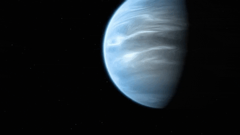

<p align="center"></p>

<h1 align="center">TOI-1231-B</h1>

<h3 align="center">
API REST de código aberto para dados de consulta de  pesquisa  as informações nela contida  foi desenvolvida usando como base nos dados da <a href="https://www.nasa.gov/subject/6893/nebulae/" target="_blank">NASA</a>
 <p align="center">
 
<a href="https://www.travis-ci.com/github/Mario23junior/Api-Nebulosas/pull_requests" target="_blank">
<a href="https://en.wikipedia.org/wiki/Representational_state_transfer"></a>
</p>

## Etapas para testar ou reproduzir

## Primeiro execute o maven 
 
```
 mvn package
```
## Em seguida faça
```
java -jar target/TOI-1231-b-API-1.0-SNAPSHOT.jar

```
## Uso

```
localhost:8080/project/api/exoplanet/data/all/v1/
```

## Resultado dos dados da API

```json
[
    {
        "nome": "TOI-1231-b",
        "numeroDeLuas": 0,
        "tipoPlaneta": "Sub-Netuno",
        "dataLancamento": "2021-01-01T00:00:00.000+00:00",
        "proximos": "Terra , Kepler 452 b , Kepler 22b , TOI-1231",
        "subNoturnDTO": [
            {
                "massa": 15.4,
                "orbitalRadius": "0.1288 AU",
                "periodoOrbital": "24.2 days",
                "ecentricidade": "0.09"
            }
        ]
    }
]

```
